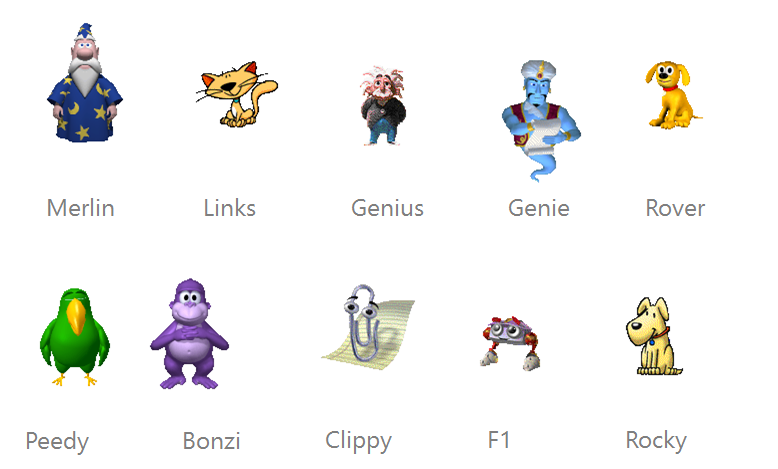
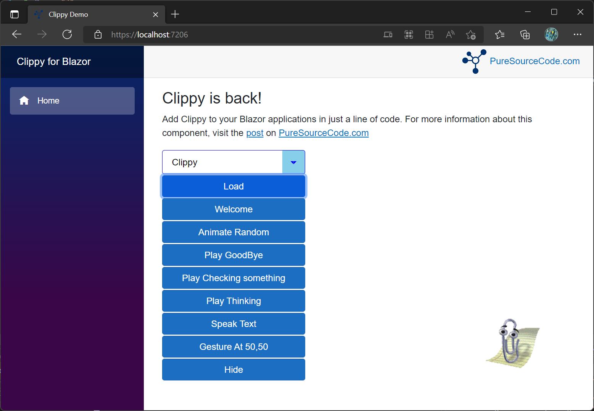
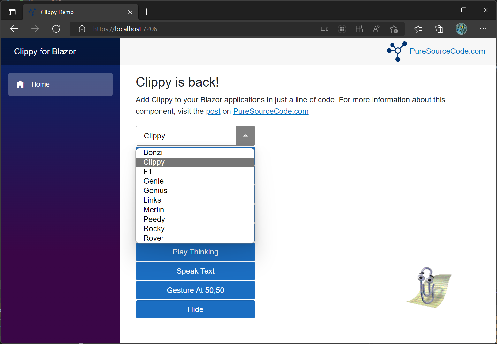

# Clippy for Blazor
Do you remember Clippy? If the answer is no, please go away!

Clippy is an Office assistant that helped users when they were using any of the Microsoft Office applications. 
Clippy's role was to communicate with users and give corresponding actions. The original name was Clippit, but it was later nicknamed "Clippy".

The name came as a result of its resemblance to a paperclip. It was one of the notable assistants that helped users when using any MS applications. 
Unfortunately, Clippy got some negative feedback from certain users that led to its removal in later Microsoft Office applications versions.

Clippy is a paperclip that was created by Kevan J. Atterberry. It was made to create a social interface to make it easier for people to understand the computer.

Generally, the idea behind Clippy was to assist users in understanding how to use the operating system. Thereby, users could access certain features on Microsoft programs and applications quickly.

The Clippy used a series of Bayesian algorithms to determine the users' needs. In a big way, it also helped in typing cues, autoformat, and other features. However, people later complained that it was intrusive ad annoying, which led to its removal.

## Add Clippy library
In your Blazor project, add the Clippy package from [Nuget](https://www.nuget.org/packages/PSC.Blazor.Components.Clippy/). 
In the `Import.razor` add the reference to the package

```c
@using PSC.Blazor.Components.Clippy
```

Then, you have to add the **Clippy** service to your project. In your `Program.cs`, add the following line

```c
using PSC.Blazor.Components.Clippy
...
builder.Services.AddScoped<ClippyService>();
```

before

```c
await builder.Build().RunAsync();
```

### Add scripts
Now, you have to add the CSS style and the scripts for Clippy. Go to your `index.html` under `wwwroot`. In the `HEAD` section, add the folloing line

```html
<link rel="stylesheet" type="text/css" href="_content/PSC.Blazor.Components.Clippy/clippy.css" media="all">
```

Then, at the bottom of the page before closing the tag `BODY` add the following scripts:

```html
<script src="_content/PSC.Blazor.Components.Clippy/clippy.min.js"></script>
<script src="_content/PSC.Blazor.Components.Clippy/clippyInterop.js"></script>
```

If your application doesn't have `jQuery`, you have to add this line

```html
<script src="_content/PSC.Blazor.Components.Clippy/jquery.slim.min.js"></script>
```

## Use Clippy
To use Clippy in a Razor page, inject `ClippyService` in the page adding this code in the `@code` section

```c
[Inject] 
public ClippyService clippy { get; set; }
```

or at the top of the page

```c
@inject ClippyService clippy
```

Now, you can use `clippy` service in the page. To load an agent, use this code

```c
await clippy.Load(agentName);
```

`agentName` is one of the following from the enum `AgentName`

- Bonzi
- Clippy (default)
- F1
- Genie
- Genius
- Links
- Merlin
- Peedy
- Rocky
- Rover



## Clippy functions

| Name              | Parameters                 | Return       | Description                                      |
|-------------------|----------------------------|--------------|--------------------------------------------------|
| AnimateRandom     |                            |              | Play an randon animation for the list            |
| GestureAt         | int x, int y               |              | The agent points in the direction of the x and y |
| GetAnimationsList |                            | List<string> | List of animation for an agent                   |
| Hide              |                            |              | Hide and dispose the agent                       |
| Load              | AgentName agentName        |              | Load an agent. By default the agent is `Clippy`. Select another agent using the enum `AgentName` |
| PlayAnimation     | ClippyAnimations animation |              | Play one of the animation for the agent. Choose from the enum `ClippyAnimations`. See below the list of available animations |
| Speak             | string text                |              | Show the `text` in the baloon                    | 
| Stop              |                            |              | Stop all actions in the queue and go back to idle mode |
| StopCurrent       |                            |              | Stop the current action in the queue             |

## Animation list

- Congratulate
- LookRight
- SendMail
- Thinking
- Explain
- IdleRopePile
- IdleAtom
- Print
- Hide
- GetAttention
- Save
- GetTechy
- GestureUp
- Idle1_1
- Processing
- Alert
- LookUpRight
- IdleSideToSide
- GoodBye
- LookLeft
- IdleHeadScratch
- LookUpLeft
- CheckingSomething
- Hearing_1
- GetWizardy
- IdleFingerTap
- GestureLeft
- Wave
- GestureRight
- Writing
- IdleSnooze
- LookDownRight
- GetArtsy
- Show
- LookDown
- Searching
- EmptyTrash
- Greeting
- LookUp
- GestureDown
- RestPose
- IdleEyeBrowRaise
- LookDownLeft

## Screenshot demo
The demo application shows all the functionalities offer from the component.


